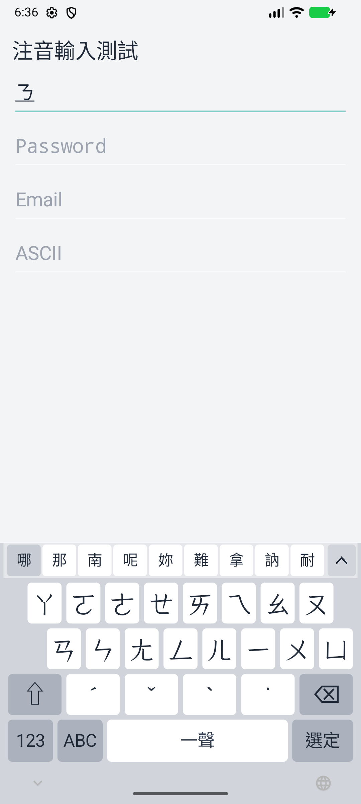
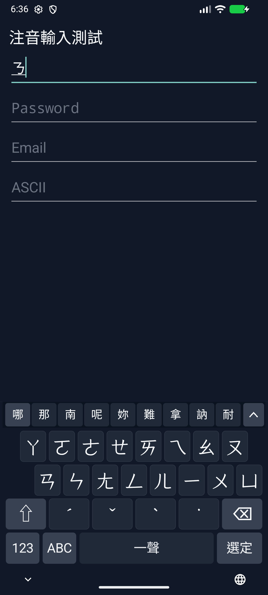
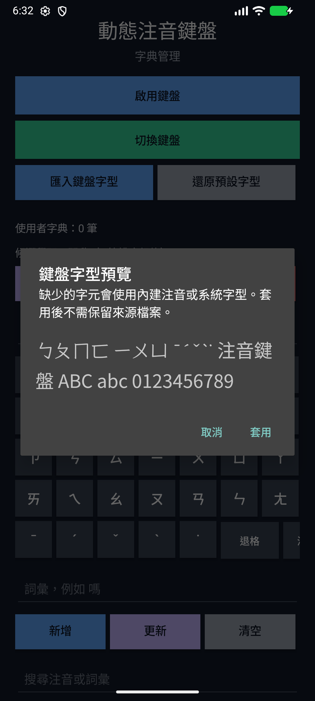

# Dynamic Zhuyin Keyboard for Android

## 📥 Join the test and download on Google Play

**Requires Android 7.0+. Complete these steps using the same Google account:**

1. [Join the testers' Google Group](https://groups.google.com/g/dynamic-zhuyin-keyboard).
2. [Open the Google Play testing page](https://play.google.com/apps/testing/dynamic.zhuyin.keyboard) and opt in to the test.
3. [Download from the Google Play store](https://play.google.com/store/apps/details?id=dynamic.zhuyin.keyboard).

If the testing page or store listing is unavailable, check that you have joined the group, opted in to the test, and are using the same Google account on the web and in Google Play on your phone.
After installation, open Dynamic Zhuyin Keyboard and use its enable-keyboard and switch-keyboard buttons.

### Direct APK download

You can also [download the Android APK (v1.2.0)](https://github.com/RaibowSky/dynamic-zhuyin-keyboard/releases/download/v1.2.0/dynamic-zhuyin-1.2.0.apk) and open the downloaded `.apk` to install it.

[Latest release and release notes](https://github.com/RaibowSky/dynamic-zhuyin-keyboard/releases/latest) · [Installation and upgrades](#installation)

On the Releases page, expand **Assets** and select the `.apk` file. The `Source code` archives are not Android installers.

A Zhuyin (Bopomofo / ㄅㄆㄇ) input method that runs entirely on the device.
It uses a dynamic-keyboard layout inspired by iOS Zhuyin input behavior while
staying fully offline and privacy-first.

[中文 README](README.md)

## What is this?

Dynamic Zhuyin Keyboard keeps Zhuyin keys in fixed positions and updates only
the candidate row and the available next keys as you type, reducing key
movement while offering candidates from a bundled on-device dictionary.

## Why?

- Give Traditional Chinese users an iOS-like dynamic Zhuyin typing feel.
- Fully offline: no Internet permission is requested; composition and candidate
  learning stay on the device.
- Privacy-first: typed content is not collected or uploaded.

## Key features

- Dynamic Zhuyin keyboard with stable, non-jumping key positions.
- Zhuyin candidate lookup from a locally generated dictionary asset.
- Continuous sentence decoding combines phrases and characters, preserves 一/不
  tone sandhi, and keeps the suffix when correcting the leading character.
- Zhuyin, English, number and symbol pages; ABC / 注 switch languages within this keyboard.
- System light/dark themes and local TTF/OTF import with preview and default reset.
- On-device candidate learning that ranks frequently used characters and words
  higher over time.
- A user dictionary with manual entries, learning pause/clear, and import/export.
- First-tone marks are merged into the space key, so no separate first-tone key
  is shown.

## Installation

For the Google Play test, follow the [steps above](#-join-the-test-and-download-on-google-play) to join the group, opt in, and install.
Download the signed APK and checksum from [Releases](https://github.com/RaibowSky/dynamic-zhuyin-keyboard/releases/latest).
Requires Android 7.0+. Version 1.1.1 restores built-in English, so another keyboard is no longer required for English input.

The Google Play version uses the new application ID `dynamic.zhuyin.keyboard`.
Android treats it as a separate app from the previous `com.ioszhuyin.keyboard` version:
export your user dictionary from the old app, import it into the new app, and enable/select the new keyboard.
Settings and clipboard history do not transfer automatically. Do not uninstall the old app before exporting.

The old Build Week debug build has a different signature: export your dictionary,
uninstall the demo, then install stable. In-place updates require the same application ID and a compatible signing certificate;
Google Play builds and directly downloaded APKs are not guaranteed to update each other.
See [release/version policy](docs/RELEASING.md).

You can also build from source:

## Build and install

Requirements:

- JDK 17
- Android SDK 36.1
- Android Build Tools 36.1.0
- An Android 7.0 (API 24) or newer device or emulator

From Windows PowerShell, run:

```powershell
.\gradlew.bat testDebugUnitTest lintDebug assembleDebug
```

The generated APK is written to:

```text
app/build/outputs/apk/debug/app-debug.apk
```

To install directly on an Android device with USB debugging enabled:

```powershell
.\gradlew.bat installDebug
```

After installation, open the Dynamic Zhuyin Keyboard app:

1. Tap **Enable keyboard** and enable Dynamic Zhuyin Keyboard in Android's
   input-method settings.
2. Return to the app, tap **Switch keyboard**, and select Dynamic Zhuyin Keyboard.
3. Type Zhuyin in any text field; the candidate row updates after every symbol.

## Screenshots

Actual Android emulator screenshots:






## Roadmap and known limitations

- Since 1.2.0: hold-space cursor movement,
  full/half-width symbols, common emoji, an opt-in clipboard history panel with pins, and public layout controls.
  Unpinned clips (up to 50) older than one hour are removed the next time the clipboard is used; up to 50 pins survive automatic cleanup.
  See [features and verification](docs/KEYBOARD-FEEDBACK.md).
- Offline sentence ranking uses frequency order, word length and local preferences;
  no network model. Version 1.2.0 adds a small starter list and locally learned
  next-word suggestions, rather than comprehensive context prediction.
- Up to nine paths per syllable position and 16 syllables per dictionary edge;
  sentence length has no three-syllable ceiling.
- TTF/OTF import supports files up to 20 MB, with bundled/system glyph fallbacks.
  A system-font catalogue remains exploratory.
- Continued OEM, older Android and physical-device coverage needs community reports.
- See [Issues](https://github.com/RaibowSky/dynamic-zhuyin-keyboard/issues) and [CHANGELOG](CHANGELOG.md).

## Privacy

The keyboard does not request Internet permission. Typed content is processed
locally on the device and is not uploaded. Candidate learning and the user
dictionary are also stored on the device.

Privacy policies:

- `PrivacyPolicy.md`
- `PrivacyPolicy.zh-TW.md`

## Dictionary data

The currently bundled dictionary asset is:

- `app/src/main/assets/zhuyin_cedict.tsv`

The asset combines CC-CEDICT Traditional entries (converted from Pinyin into
Zhuyin keys) with McBopomofo multi-character phrase readings, ranked with
McBopomofo aggregate phrase frequency. No underlying corpus is packaged.

Relevant scripts:

- `tools/build_zhuyin_dictionary.py`
- `tools/rank_zhuyin_dictionary.py`
- `tools/merge_mcbopomofo_dictionary.py`

For source and license attribution, see:

- `NOTICE.md`
- `NOTICE.zh-TW.md`
- `app/src/main/assets/zhuyin_cedict_LICENSE.txt`
- `tools/data/README.md`

## Reporting issues and contributing

Found a bug or want to suggest a feature? Open an
[issue](https://github.com/RaibowSky/dynamic-zhuyin-keyboard/issues).

Before contributing:

- Confirm the issue is not already being handled and describe your plan there.
- Before adding third-party data, dictionaries, fonts, or assets, verify the
  license and update `NOTICE.md` and `NOTICE.zh-TW.md` with the source URL,
  retrieval date, license terms, and transformation.
- Run `.\gradlew.bat testDebugUnitTest lintDebug assembleDebug` to verify tests,
  lint, and the build.
- Rebase or sync with `main` before opening a PR, and describe the change scope
  clearly.

## Project history

This project originated during OpenAI Build Week, where Codex and GPT-5.6 were
used to extend and stabilize an Android Zhuyin keyboard that already worked
before the event. Pre-event work remains the baseline, and features or fixes
added during the event are recorded in the commit history.

All model-generated changes were reviewed, built, and tested against the real
application before acceptance. This history is kept here for transparency and is
not the project's central framing today.

## License

Except where otherwise noted, this project's original source code is licensed
under the [Apache License 2.0](LICENSE).

The root Apache-2.0 license does not relicense third-party material. The
generated data derived from CC-CEDICT is subject to CC BY-SA 4.0, the McBopomofo
phrase readings and aggregate frequency data are subject to its MIT License and
upstream data notices, and the ToneOZ font subset is subject to the SIL Open Font
License 1.1. See [NOTICE.md](NOTICE.md) and [NOTICE.zh-TW.md](NOTICE.zh-TW.md)
for complete attribution, transformations, and local license copies.
