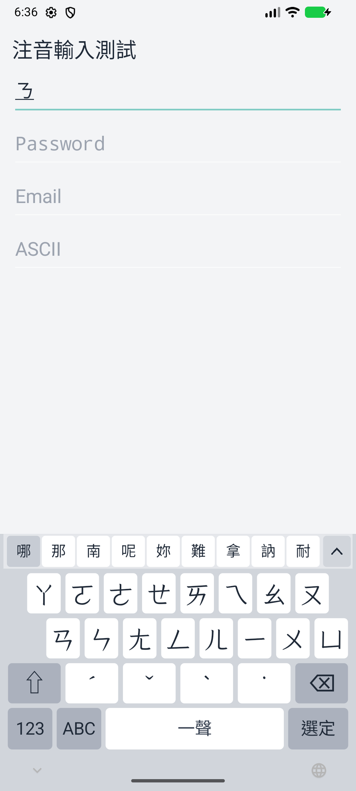
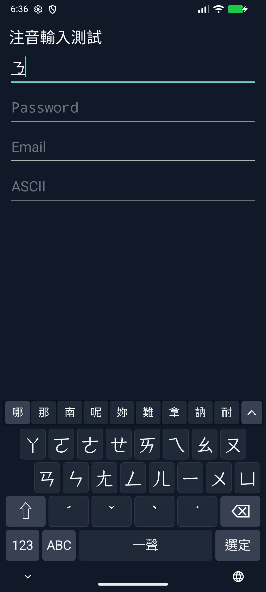
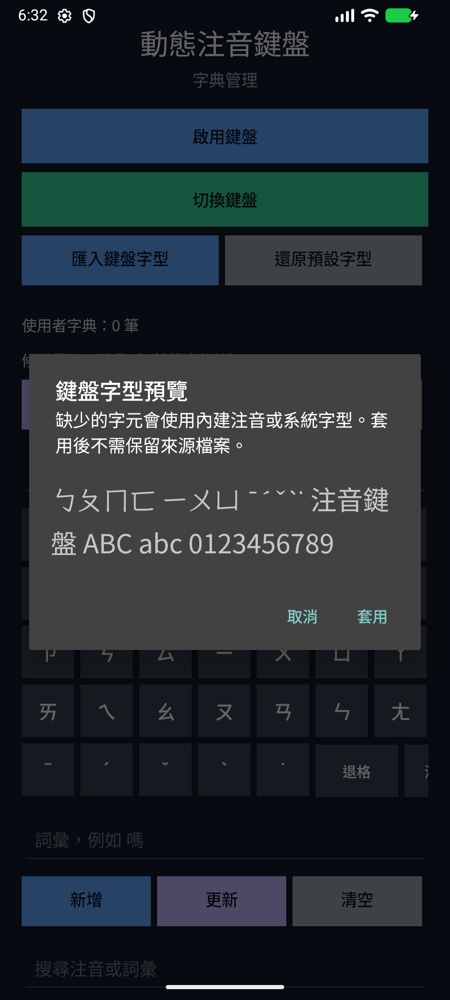

# 動態注音鍵盤（Dynamic Zhuyin Keyboard）

一套在 Android 裝置本機運作的注音（Bopomofo／ㄅㄆㄇ）輸入法，採用「動態鍵盤」
設計，目標是提供接近 iOS 注音輸入法的輸入體驗，同時保持完全離線、注重隱私。

[English README](README.en.md)

## 這是什麼？

「動態注音鍵盤」把注音符號放在固定位置，輸入時只更新候選列與可用的下一鍵，
減少鍵位跳動，並以裝置本機的詞庫提供候選字／詞。

## 為什麼做這個？

- 提供繁體中文使用者更接近 iOS 注音輸入法的動態鍵盤手感。
- 完全離線：不宣告網路權限，輸入內容與候選學習都在裝置本機完成。
- 注重隱私：不蒐集、不上傳打字內容。

## 主要功能

- 動態注音鍵盤：按鍵位置固定，輸入時不跳位。
- 注音候選查詢：使用本地產生的注音候選字典。
- 連續整句解碼：組合多個已知詞與單字，支援「一／不」變調與保留後綴的首字修正。
- 注音、數字與符號頁；「ABC」切換到已啟用的外部輸入法。
- 系統淺色／深色主題、可預覽的本機 TTF／OTF 字型匯入與預設字型還原。
- 本機候選學習：常用的字／詞會隨著使用往前排。
- 使用者詞典：支援手動詞彙、暫停／清除學習、匯入／匯出。
- 一聲與空白鍵邏輯合併，不另外顯示一聲按鍵。

## 安裝

正式簽署 APK 與 checksum 請見 [Releases](https://github.com/RaibowSky/dynamic-zhuyin-keyboard/releases/latest)。
Android 7.0 以上可安裝；英文輸入需要另一個已啟用的系統輸入法。
舊 Build Week debug 版簽章不同，轉換前請先匯出字典，再移除舊版、安裝正式版。
後續正式版沿用同一簽章，可直接更新。[發版與版本規則](docs/RELEASING.md)。

也可以從原始碼自行建置：

## 建置與安裝

需求：

- JDK 17
- Android SDK 36.1
- Android Build Tools 36.1.0
- Android 7.0（API 24）以上的裝置或模擬器

在 Windows PowerShell 執行：

```powershell
.\gradlew.bat testDebugUnitTest lintDebug assembleDebug
```

產生的 APK 位於：

```text
app/build/outputs/apk/debug/app-debug.apk
```

也可以連接已開啟 USB 偵錯的 Android 裝置後直接安裝：

```powershell
.\gradlew.bat installDebug
```

安裝後開啟「動態注音鍵盤」應用程式：

1. 點選「啟用鍵盤」，在 Android 輸入法設定中啟用「動態注音鍵盤」。
2. 返回應用程式並點選「切換鍵盤」，選擇「動態注音鍵盤」。
3. 在任意文字欄位輸入注音；候選列會隨每個注音符號更新。

## 螢幕截圖

Android 模擬器實際執行畫面：






## Roadmap 與已知限制

- 整句排序採用離線詞頻順序、詞長與本機偏好，沒有網路模型或提交後的下一詞預測。
- 每個音節位置保留最多 9 條解碼路徑，詞邊最多 16 音節；整句長度沒有 3 音節限制。
- 自訂字型支援 TTF／OTF（上限 20 MB）；缺字會退回內建／系統字型。系統字型清單仍待研究。
- 裝置廠牌、較舊 Android 版本與實體裝置的持續測試仍需要回報。
- 目前進度請見 [Issues](https://github.com/RaibowSky/dynamic-zhuyin-keyboard/issues) 與 [CHANGELOG](CHANGELOG.md)。

## 隱私

本鍵盤不宣告網路權限，輸入內容在裝置本機處理，不會上傳。候選學習與使用者詞典
也都保存在裝置本機。

隱私權政策請看：

- `PrivacyPolicy.zh-TW.md`
- `PrivacyPolicy.md`

## 字典資料

目前實際打包在專案中的候選字典是：

- `app/src/main/assets/zhuyin_cedict.tsv`

這份檔案合併兩種已標示來源的資料：CC-CEDICT 的繁體詞條與拼音讀音會轉成注音查詢鍵；
McBopomofo 的多字片語讀音會補充台灣常用詞，並使用其彙總詞頻排列候選。原始語料不會
打包進 App。

轉換腳本：

- `tools/build_zhuyin_dictionary.py`
- `tools/rank_zhuyin_dictionary.py`
- `tools/merge_mcbopomofo_dictionary.py`

資料來源與授權請看：

- `NOTICE.md`
- `NOTICE.zh-TW.md`
- `app/src/main/assets/zhuyin_cedict_LICENSE.txt`
- `tools/data/README.md`

## 回報問題與貢獻

發現 bug 或想提功能建議，請到
[Issues](https://github.com/RaibowSky/dynamic-zhuyin-keyboard/issues) 開新的 issue。

貢獻前請注意：

- 先確認 issue 尚未有人處理，並在 issue 中說明你的計畫。
- 新增第三方資料、詞庫、字型或素材前，請先確認授權，並同步更新 `NOTICE.md` 與
  `NOTICE.zh-TW.md`（包含來源網址、取得日期、授權條款與轉換方式）。
- 修改後請執行 `.\gradlew.bat testDebugUnitTest lintDebug assembleDebug` 確認測試、
  lint 與建置通過。
- 發 PR 前請與 `main` 同步，並清楚說明改動範圍。

## 專案歷史

本專案起源於 OpenAI Build Week 期間，以 Codex 與 GPT-5.6 協助延伸與穩定一個
活動前就已能運作的 Android 注音鍵盤原型；既有成果保留為 baseline，活動期間新增的
功能與修正則逐項記錄於 commit 歷史。

所有模型產生的修改都經過人工檢查、實際建置與裝置測試後才接受。這段歷史保留在本節
作為透明紀錄，不作為專案目前的中心定位。

## 授權

除另有標示者外，本專案的原始程式碼採用 [Apache License 2.0](LICENSE)。

根目錄的 Apache-2.0 不會重新授權第三方資料。由 CC-CEDICT 轉換而來的候選資料遵守
CC BY-SA 4.0；McBopomofo 片語讀音與彙總詞頻資料遵守其 MIT License 與上游資料聲明；
ToneOZ 字型 subset 遵守 SIL Open Font License 1.1。完整來源、轉換方式與授權副本請見
[NOTICE.zh-TW.md](NOTICE.zh-TW.md) 與 [NOTICE.md](NOTICE.md)。
